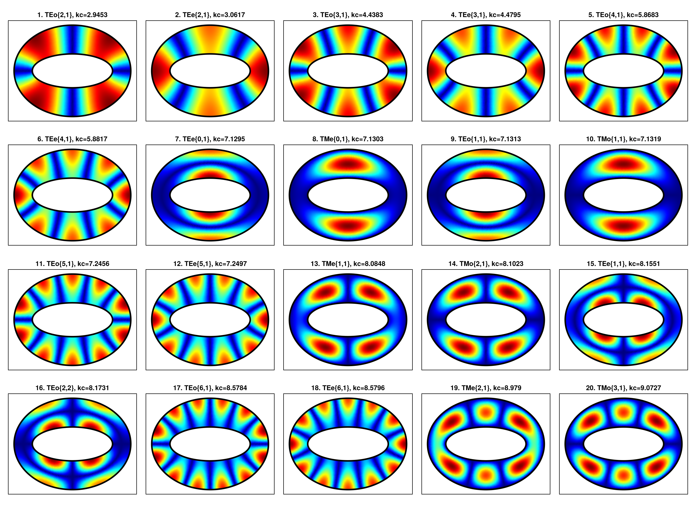
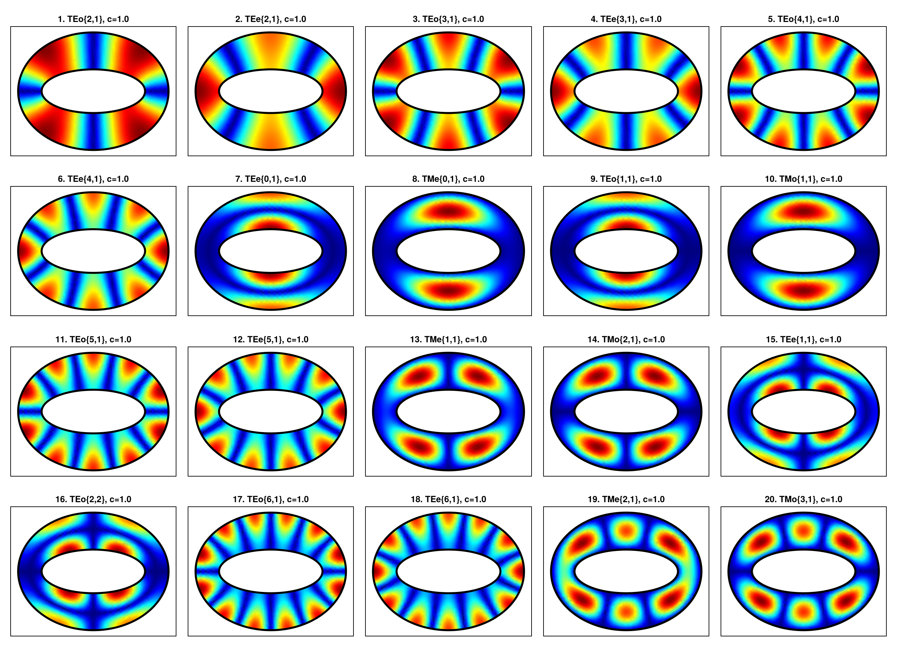
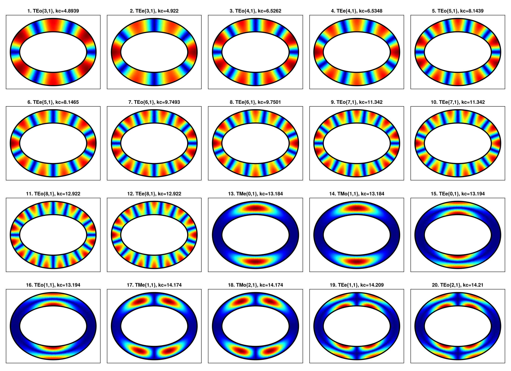
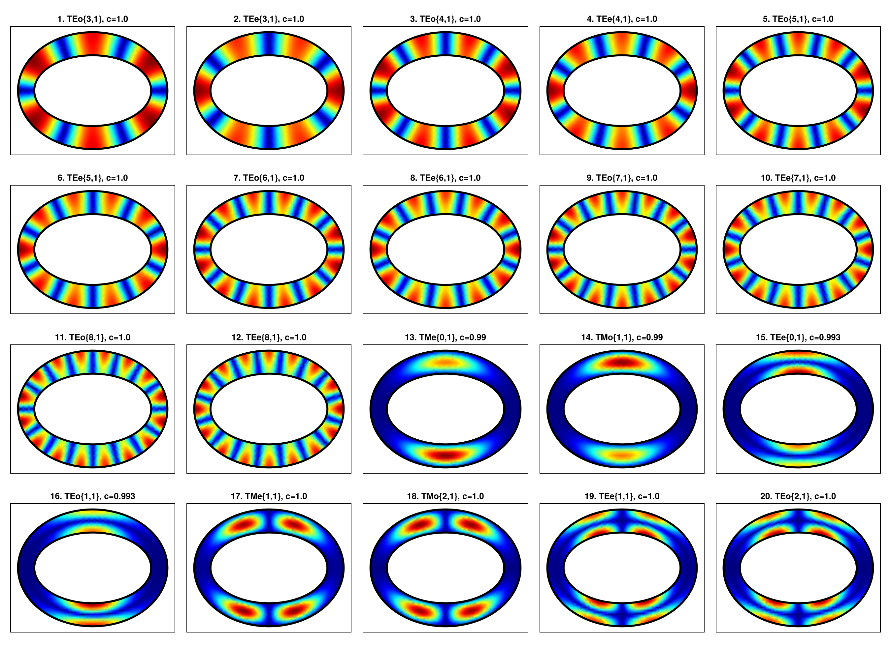
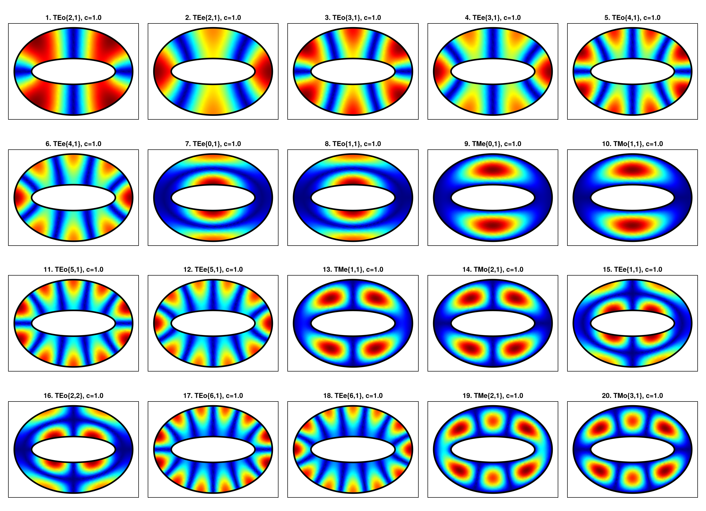

# Confocal Elliptic Coax Gallery

This page collects pre-generated galleries for confocal elliptic coaxial waveguides. The images are embedded as static assets, so documentation builds do not rerun the gallery scripts.

Each case compares the analytical scalar modal fields against a finite-element reference on the same confocal annular geometry.

## Moderate Gap

| Analytic scalar modes | Gridap scalar modes |
|:--:|:--:|
|  |  |

## Narrow Gap

| Analytic scalar modes | Gridap scalar modes |
|:--:|:--:|
|  |  |

## Eccentric Gap

| Analytic scalar modes | Gridap scalar modes |
|:--:|:--:|
|  |  |
