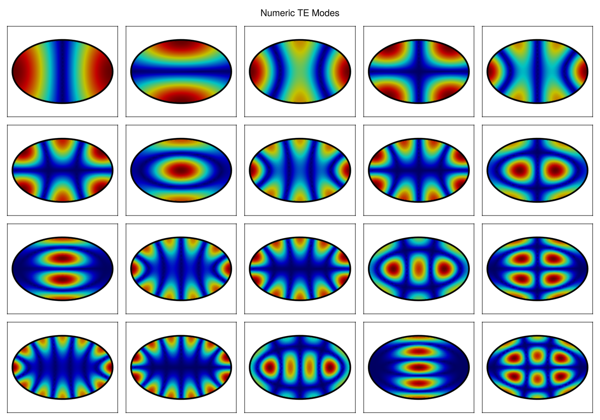
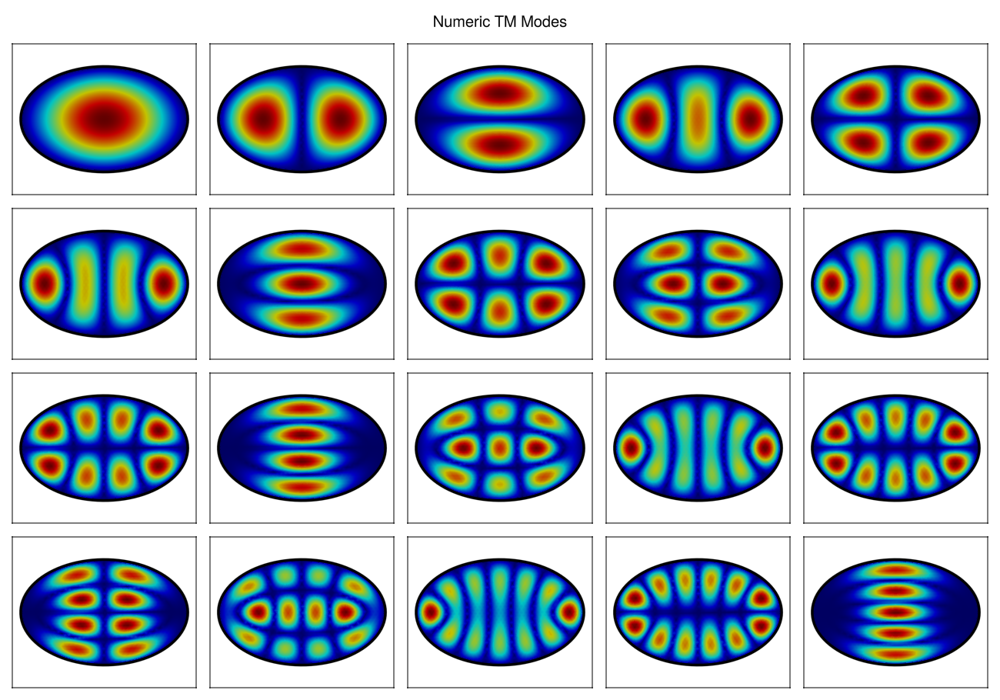

```@meta
    ShareDefaultModule = true
```

```@setup
include("../Assets/docs_include.jl")
```

# Elliptic Waveguide

Elliptic waveguides are less common than the rectangular and circular geometries. Like other waveguide types, they support both **TE** and **TM** modes. Their distinctive characteristic is that they admit *even* and *odd* solution pairs formed using even and odd Mathieu functions. Consequently, except for m = 0, each mode designation (m, n) corresponds to two distinct modes with different cutoff frequencies.

## Numerical Example

As in previous sections, we first present numerical solutions obtained with `Gridap.jl` to serve as validation references for the analytical expressions.

> Mesh files (.msh) can be found in *\src\Assets\mesh* and are generated with Gmsh.jl using functions in *\src\Assets\example_mesh.jl*.

The Hz field (longitudinal magnetic component) for the first **TE** modes computed numerically:

```julia

using GLMakie

name = "../Assets/mesh/elliptic_wg1.msh"
a = 1
b = 0.7
ellipticwg_mesh(a, b; dl = 0.05, name)
model = GmshDiscreteModel(name, renumber = false)


A_te, B_te, U_te, V_te = engeimode_gridap(model, :TE, order = 2)
A_tm, B_tm, U_tm, V_tm = engeimode_gridap(model, :TM, order = 2)

nev = 24
λ_te, ϕ_te = eigs(A_te, B_te; nev=nev, which=:SM, maxiter=5300)
λ_tm, ϕ_tm = eigs(A_tm, B_tm; nev=nev, which=:SM, maxiter=5300)


t = range(0, 2*pi, length=100)
ellip_x_r = @. b * sin(t)
ellip_y_r = @. a * cos(t)

tria = Triangulation(model)
gridap_coords = get_node_coordinates(model)
makie_coords = map(x->Point2f(x.data), gridap_coords)
face_to_nodes = stack(map(x->x, get_cell_node_ids(model)))'

fig = Figure(size = (1300, 910))
plot_ids = Iterators.product(1:5, 1:4) |> collect |> vec
for (idp, (ii, jj)) in enumerate(plot_ids)
    uh = FEFunction(V_te, real.(ϕ_te[:, idp+1]), get_dirichlet_dof_values(V_te))
    gridap_values = evaluate(uh, gridap_coords)
    fz_num = abs.(gridap_values)
    fz_num = fz_num / maximum(fz_num)
    coord2 = makie_coords[argmin(fz_num)]
    axi = Axis(fig[jj,ii])
    t = lines!(axi, ellip_y_r, ellip_x_r, linewidth = 3.5, color = :black)
    translate!(t, (0, 0, 2))
    xlims!(-a*1.1, a*1.1)
    ylims!(-a, a)
    mesh!(axi, makie_coords, face_to_nodes, color = fz_num, colormap = :jet)
    hidedecorations!(axi)
end
Label(fig[0, 2:4], "Numeric TE Modes", fontsize = 20)
fig
```


The numerical eigenmode solution reveals the complex field patterns characteristic of elliptic geometries. 

The Ez field (longitudinal electric component) for the first **TM** modes:

```julia
fig = Figure(size = (1300, 910))
plot_ids = Iterators.product(1:5, 1:4) |> collect |> vec
for (idp, (ii, jj)) in enumerate(plot_ids)
    uh = FEFunction(V_tm, real.(ϕ_tm[:, idp]), get_dirichlet_dof_values(V_tm))
    gridap_values = evaluate(uh, gridap_coords)
    fz_num = abs.(gridap_values)
    fz_num = fz_num / maximum(fz_num)
    coord2 = makie_coords[argmin(fz_num)]
    axi = Axis(fig[jj,ii])
    t = lines!(axi, ellip_y_r, ellip_x_r, linewidth = 3.5, color = :black)
    translate!(t, (0, 0, 2))
    xlims!(-a*1.1, a*1.1)
    ylims!(-a, a)
    mesh!(axi, makie_coords, face_to_nodes, color = fz_num, colormap = :jet)
    hidedecorations!(axi)
end
Label(fig[0, 2:4], "Numeric TM Modes", fontsize = 20)
fig
```


TM modes in elliptical waveguides exhibit similar complexity, with field patterns governed by the interplay of Mathieu functions in both coordinate directions.

## Analytical Solutions

The analytical evaluation of elliptic waveguide modes uses Mathieu functions, which are more computationally intensive than Bessel or trigonometric functions. The field solutions require evaluating both angular Mathieu functions (ceₘ, seₘ for even/odd) and radial Mathieu functions (Ceₘ, Seₘ). To improve computational efficiency, the Mathieu function coefficients can be pre-computed outside the field evaluation calls.

The following code evaluates the analytical **TE** mode fields using `te_ewg_fields`. The parameter `even` determines whether even (true) or odd (false) Mathieu functions are used, corresponding to different mode symmetries and cutoff frequencies.

```@example

using GLMakie

name = "../Assets/mesh/elliptic_wg1.msh"
a = 1
b = 0.7
#ellipticwg_mesh(a, b; dl = 0.05, name)

coord, conn = mesh_data(name)
coords = coord[:, 1:maximum(conn)]
xcoords = coords[1, :]
ycoords = coords[2, :]

ellipcoords = map((x, y) -> cart2elliptic(x, y, a, b), xcoords, ycoords)
ξcoords = getindex.(ellipcoords, 1)
ηcoords = getindex.(ellipcoords, 2)

t = range(0, 2*pi, length=100)
ellip_x_r = @. b * sin(t)
ellip_y_r = @. a * cos(t)

modekind = [(1, 1, true), (1, 1, false), (2, 1, true), (2, 1, false), (3, 1, true), 
            (3, 1, false), (0, 1, true), (4, 1, true), (4, 1, false),  (1, 2, true), (1, 2, false), 
            (5, 1, true), (5, 1, false), (2, 2, true), (2, 2, false), (6, 1, true), (6, 1, false), 
            (3, 2, true), (0, 2, true), (3, 2, false)]

plot_ids = Iterators.product(1:5, 1:4) |> collect |> vec

fig = Figure(size = (1300, 910))   
for (idplot, (m, n, even)) in enumerate(modekind)
    ii,jj = plot_ids[idplot]

    fields = te_ewg_fields(ξcoords, ηcoords, a, b, m, n, even, 100e9, 1.0, 1.0)
    fz = getindex.(fields, 6)

    stitle = even ? L"TE_{c%$m%$n}" : L"TE_{e%$m%$n}"
    axi = Axis(fig[jj,ii], title = stitle, titlesize = 20)
    hidedecorations!(axi)

    t = lines!(axi, ellip_y_r, ellip_x_r, linewidth = 3.5, color = :black)
        translate!(t, (0, 0, 2))

    mesh!(axi, coords, conn, color = abs.(fz), colormap = :jet)
    xlims!(-a*1.1, a*1.1)
    ylims!(-a, a)
end
fig
```

The visualization shows 20 TE modes with labels indicating even (c) or odd (e) character. Note that for m > 0, both even and odd modes exist with different cutoff frequencies and patterns.

**TM modes** for the same elliptic geometry:

```@example

     
modekind = [(0, 1, true),(1, 1, true),(1, 1, false),(2, 1, true),(2, 1, false),(3, 1, true),
            (0, 2, true),(3, 1, false),(1, 2, true),(4, 1, true),(4, 1, false),(1, 2, false),
            (2, 2, true),(5, 1, true),(5, 1, false),(2, 2, false),(3, 2, true),(6, 1, true),
            (6, 1, false),(0, 3, true)]

fig = Figure(size = (1300, 910))
for (idplot, (m, n, even)) in enumerate(modekind)
    ii,jj = plot_ids[idplot]

    fields = tm_ewg_fields(ξcoords, ηcoords, a, b, m, n, even, 100e9, 1.0, 1.0)
    fz = getindex.(fields, 3)

    stitle = even ? L"TM_{c%$m%$n}" : L"TM_{e%$m%$n}"
    axi = Axis(fig[jj,ii], title = stitle, titlesize = 20)
    hidedecorations!(axi)

    t = lines!(axi, ellip_y_r, ellip_x_r, linewidth = 3.5, color = :black)
    translate!(t, (0, 0, 2))

    mesh!(axi, coords, conn, color = abs.(fz), colormap = :jet)
    xlims!(-a*1.1, a*1.1)
    ylims!(-a, a)
end
fig
```

The even/odd distinction is clearly visible in the field symmetries.

## Transverse Field Components

For elliptic coordinates, the transverse field components require coordinate transformation from the native elliptic system (ξ, η) to Cartesian coordinates (x, y). The `metric_and_unit_elliptic` function provides the necessary metric coefficients and unit vector components for this transformation.

The following example visualizes the transverse magnetic field for selected TM modes:

```@example

ρ = sqrt(a^2-b^2)

modekind = [(0, 1, true),(1, 1, true),(1, 1, false),(2, 1, true),(2, 1, false),(3, 1, true)]
plot_ids = Iterators.product(1:3, 1:2) |> collect |> vec

fig = Figure(size = (1300, 910))
for (idplot, (m, n, even)) in enumerate(modekind)
    ii,jj = plot_ids[idplot]
  
    fields = tm_ewg_fields(ξcoords, ηcoords, a, b, m, n, even, 100e9, 1.0, 1.0)

    fz = map(fields, ξcoords, ηcoords) do ehfields, ξi, ηi
        h, exi_x, exi_y, eeta_x, eeta_y = metric_and_unit_elliptic(ρ, ξi, ηi)
        Fx = ehfields[4] * exi_x + ehfields[5] * eeta_x
        Fy = ehfields[4] * exi_y + ehfields[5] * eeta_y
        return (Fx, Fy)
    end

    stitle = even ? L"TM_{c%$m%$n}" : L"TM_{e%$m%$n}"
    axi = Axis(fig[jj,ii], title = stitle, titlesize = 20)
    hidedecorations!(axi)

    t = lines!(axi, ellip_y_r, ellip_x_r, linewidth = 3.5, color = :black)
        translate!(t, (0, 0, 2))

    fu = real.(getindex.(fz, 1))
    fv = real.(getindex.(fz, 2))
    ft = map(x->hypot(x...), fz) * 35
    vm = maximum(ft)*10
    fu = fu ./ ft
    fv = fv ./ ft

    arrows2d!(axi, xcoords, ycoords, fu, fv, color = ft, colormap = :jet)

    xlims!(-a*1.1, a*1.1)
    ylims!(-a, a)
end
fig
```
