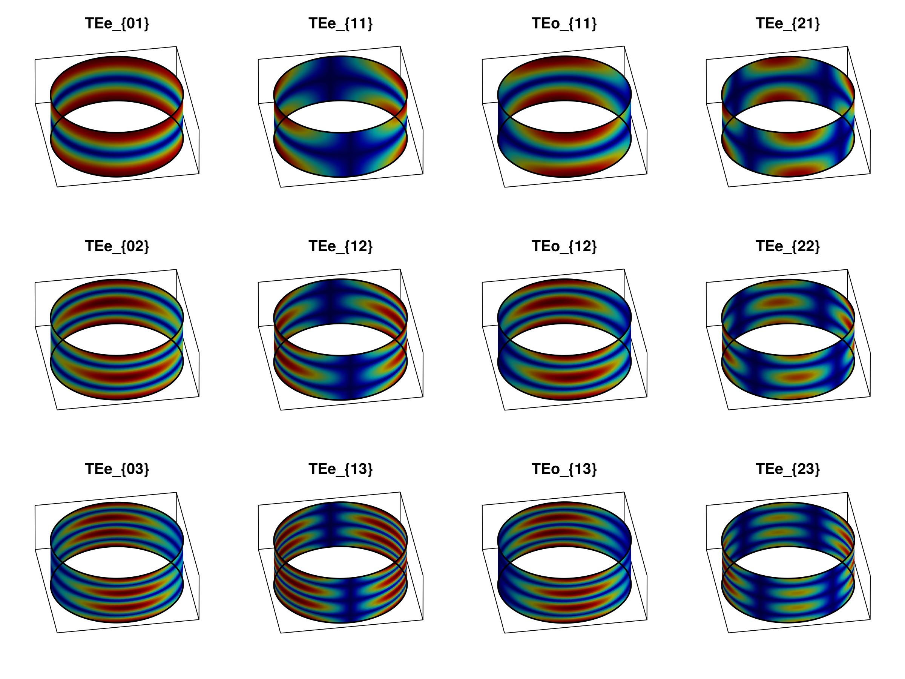
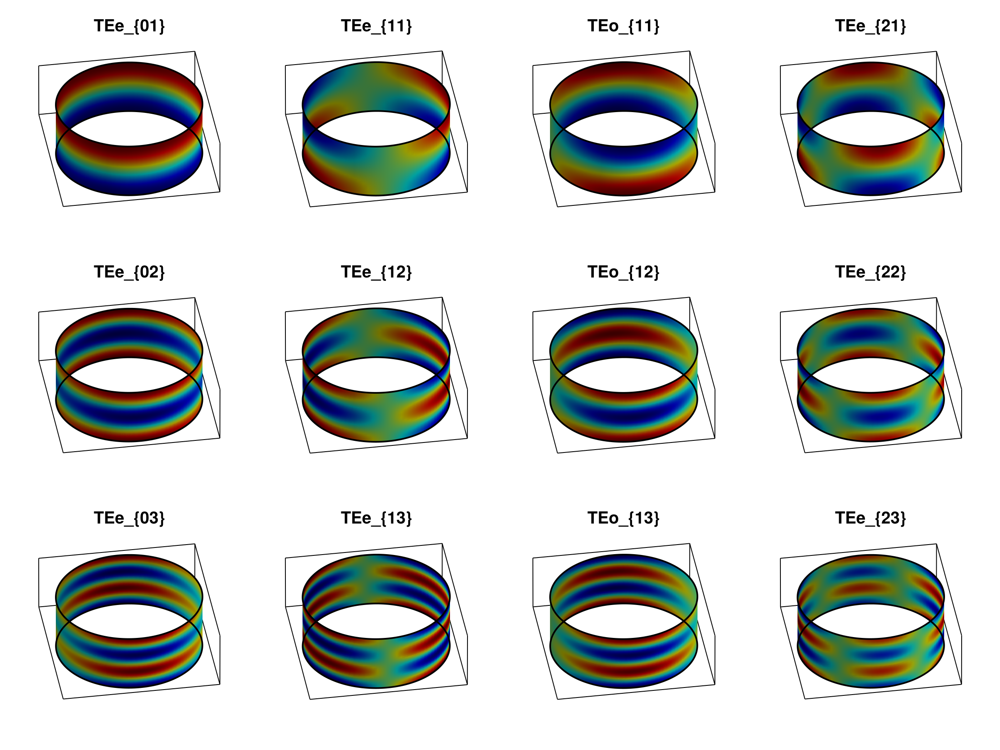
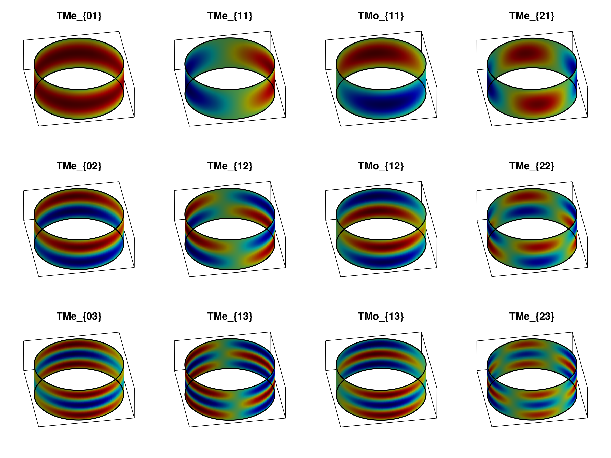
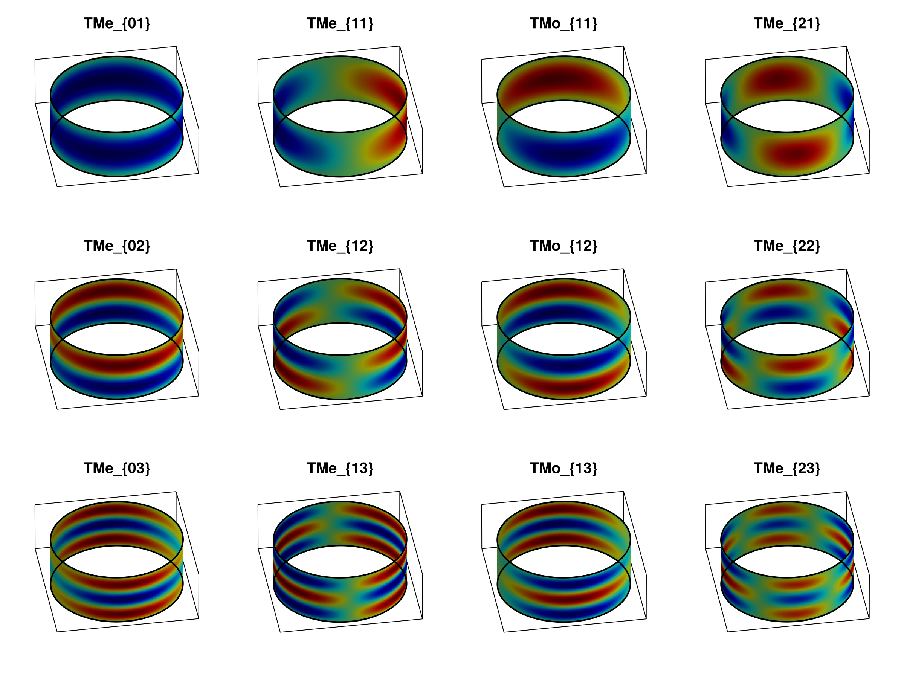
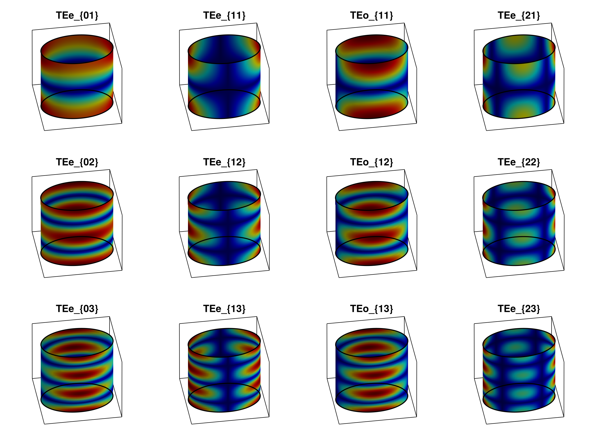
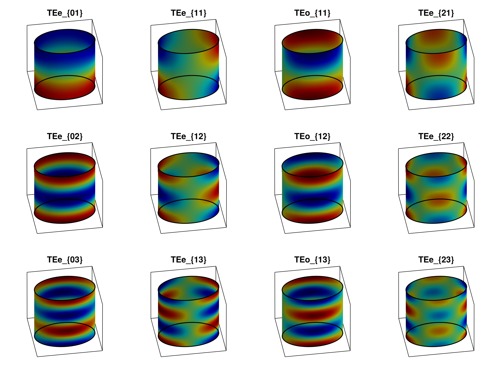
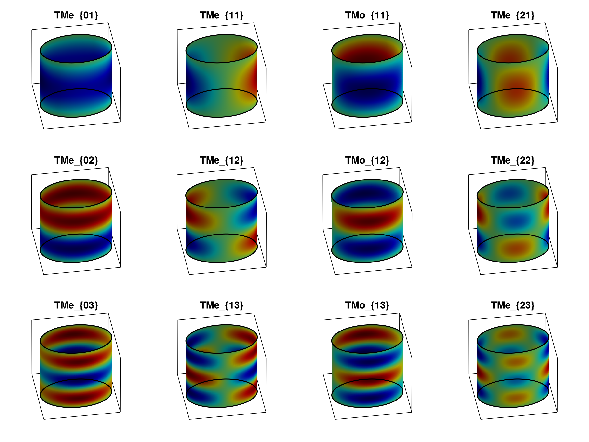
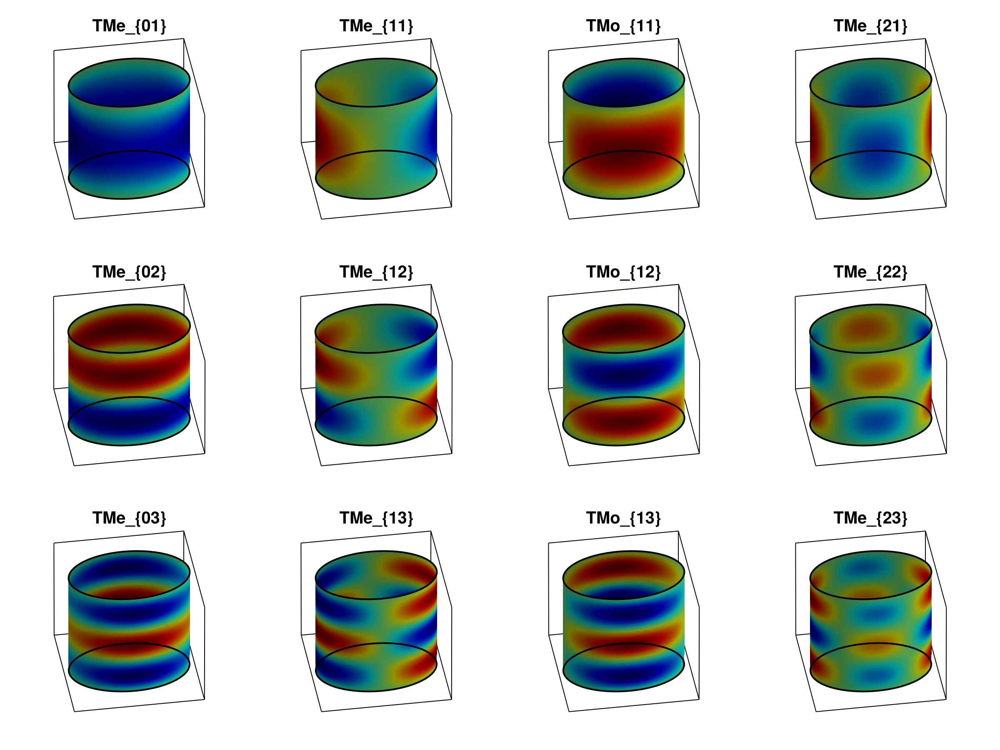

# Elliptic Radial Gallery

This page collects pre-generated field galleries for elliptic radial waveguides. The images are embedded here as static assets, so they are not recomputed during documentation builds.

## Moderate Elliptic Section

The moderate case uses a smoother elliptic cross-section and displays the first modes for representative TE and TM transverse components.

| TE ``|H_\xi|`` | TE ``\operatorname{Re}(H_\xi)`` |
|:--:|:--:|
|  |  |

| TM ``\operatorname{Re}(E_\xi)`` | TM ``\operatorname{Im}(E_\xi)`` |
|:--:|:--:|
|  |  |

## Eccentric Elliptic Section

The eccentric case stresses the same mode evaluation on a more elongated elliptic coordinate surface.

| TE ``|H_\xi|`` | TE ``\operatorname{Re}(H_\xi)`` |
|:--:|:--:|
|  |  |

| TM ``\operatorname{Re}(E_\xi)`` | TM ``\operatorname{Im}(E_\xi)`` |
|:--:|:--:|
|  |  |
