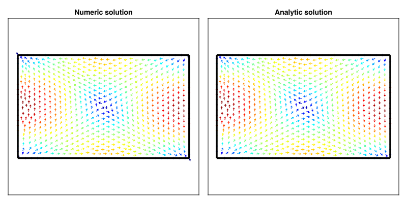

```@meta
    ShareDefaultModule = true
```

```@setup
include("../Assets/docs_include.jl")
```

# Rectangular Waveguide

Rectangular waveguides are the most common and analytically tractable waveguide geometry. The solutions for TE and TM modes are expressed using simple trigonometric functions (sin, cos), making them ideal for both educational purposes and practical applications. The mode indices (m, n) directly correspond to the number of half-wave variations along the width (a) and height (b) dimensions.

## Numerical / Analytical Comparison

To validate the analytical solutions, we solve the eigenmode problem numerically using finite element method. A rectangular mesh is generated for the waveguide cross-section using Gmsh.

> Mesh files (.msh) can be found in *\src\Assets\mesh* and are generated with Gmsh.jl using functions in *\src\Assets\example_mesh.jl*.

For the numerical solution, we solve for the scalar longitudinal field Hz (for **TE** modes) or Ez (for **TM** modes), which satisfies a Helmholtz equation with appropriate boundary conditions.


```julia

W = 1.0
H = 0.5
name = "../Assets/mesh/rectangular_wg1.msh"
rwg_mesh(W, H; dl = 0.025, name = name)
model = GmshDiscreteModel(name, renumber = false)

A_te, B_te, U_te, V_te = engeimode_gridap(model, :TE, order = 2)
A_tm, B_tm, U_tm, V_tm = engeimode_gridap(model, :TM, order = 2)

nev = 10
λ_te, ϕ_te = eigs(A_te, B_te; nev=nev, which=:SM, maxiter=5300)
λ_tm, ϕ_tm = eigs(A_tm, B_tm; nev=nev, which=:SM, maxiter=5300)


using GLMakie
fig = Figure( size = (800, 400) )

freq = 10.0e9
mn = 3
m, n = 2, 0
uh = FEFunction(V_te, real.(ϕ_te[:, mn]), get_dirichlet_dof_values(V_te))

Ω_triang = get_triangulation(model)
gridap_coords = get_node_coordinates(Ω_triang)
makie_coords = map(x->Point2f(x.data), gridap_coords)
face_to_nodes = stack(map(x->x, get_cell_node_ids(Ω_triang)))'

fz_num = evaluate(uh, gridap_coords)

ax1 = Axis(fig[1,1], title = "Numeric solution")
lines!(ax1, [0.0, W], [0.0, 0.0], linewidth = 3.5, color = :black)
lines!(ax1, [0.0, W], [H, H], linewidth = 3.5, color = :black)
lines!(ax1, [0.0, 0.0], [0.0, H], linewidth = 3.5, color = :black)
lines!(ax1, [W, W], [0.0, H], linewidth = 3.5, color = :black)
mesh!(ax1, makie_coords, face_to_nodes, color = abs.(fz_num), colormap = :jet)
ylims!(ax1, -W*0.25, H + W*0.25)
hidedecorations!(ax1)

# Analytic solution

uh_a = CellField(x-> begin
    (ex, ey, ez, hx, hy, hz) = te_rwg_fields(x[1], x[2], W, H, m, n, freq, 1.0, 1.0) 
    return abs(hz)
    end, Ω_triang)

fz_an = evaluate(uh_a, gridap_coords)

ax2 = Axis(fig[1,2], title = "Analytic solution")
lines!(ax2, [0.0, W], [0.0, 0.0], linewidth = 3.5, color = :black)
lines!(ax2, [0.0, W], [H, H], linewidth = 3.5, color = :black)
lines!(ax2, [0.0, 0.0], [0.0, H], linewidth = 3.5, color = :black)
lines!(ax2, [W, W], [0.0, H], linewidth = 3.5, color = :black)
mesh!(ax2, makie_coords, face_to_nodes, color = abs.(fz_an), colormap = :jet)
ylims!(ax2, -W*0.25, H + W*0.25)
hidedecorations!(ax2)
fig
```


The comparison shows excellent agreement between the numerical eigenmode solution and the analytical expression. Both solutions show the TE₂₀ mode pattern with two half-wavelength variations along the width and uniform field along the height.

We can quantify the error by normalizing the field amplitudes:

```julia
n_num = sqrt(sum(abs2, fz_num))
n_an = sqrt(sum(abs2, fz_an))
fz_num_norm = abs.(fz_num)/n_num 
fz_an_norm = abs.(fz_an)/n_an
rmse = err = sqrt(sum(abs2, fz_num_norm-fz_an_norm)/length(fz_an_norm)) # rmse =  0.00010047866871897437
```

The normalized RMSE of approximately 0.0001 demonstrates excellent agreement between the analytical and numerical solutions.

## Analytical Results

We now compute a comprehensive gallery of rectangular waveguide modes using the analytical functions `te_rwg_fields` and `tm_rwg_fields`. The following visualization displays 24 modes ordered by increasing cutoff frequency, showing both TE and TM types.

```@example

freq = 10e9
fig = Figure(size = (1200, 900))

W = 1.0
H = 0.7

name = "../Assets/mesh/rectangular_wg2.msh"

#rwg_mesh(W, H; dl = 1e-2, name)

coord, conn = mesh_data(name)
coords = coord[:, 1:maximum(conn)]
xcoords = coords[1, :]
ycoords = coords[2, :]

modekind = [(:TE, 1, 0), (:TE, 0, 1), (:TE, 1, 1), (:TM, 1, 1),
(:TE, 2, 0), (:TE, 2, 1), (:TM, 2, 1), (:TE, 0, 2), (:TE, 3, 0),
(:TE, 1, 2), (:TM, 1, 2), (:TE, 3, 1), (:TM, 3, 1), (:TE, 2, 2),
(:TM, 2, 2), (:TE, 4, 0), (:TE, 3, 2), (:TM, 3, 2), (:TE, 4, 1), 
(:TM, 4, 1), (:TE, 0, 3), (:TE, 1, 3), (:TM, 1, 3), (:TE, 2, 3)]

plot_ids = Iterators.product(1:6, 1:4) |> collect |> vec

for (idp, (ki, m, n)) in enumerate(modekind)
    stitle = L"%$(ki)_{%$m,%$n}"
    ii, jj = plot_ids[idp]
    axi = Axis(fig[jj, ii], title = stitle, titlesize = 20)
    hidedecorations!(axi)

    if ki == :TE
        fields = te_rwg_fields(xcoords, ycoords, W, H, m, n, freq, 1.0, 1.0)
        fz = map(x->abs(x[6]), fields) # Hz
    else
        fields = tm_rwg_fields(xcoords, ycoords, W, H, m, n, freq, 1.0, 1.0)
        fz =  map(x->abs(x[3]), fields) # Ez
    end 

    t1 = lines!(axi, [0.0, W], [0.0, 0.0], linewidth = 3.5, color = :black)
    t2 = lines!(axi, [0.0, W], [H, H], linewidth = 3.5, color = :black)
    t3 = lines!(axi, [0.0, 0.0], [0.0, H], linewidth = 3.5, color = :black)
    t4 = lines!(axi, [W, W], [0.0, H], linewidth = 3.5, color = :black)
    translate!(t1, (0.0, 0.0, 1.0))
    translate!(t2, (0.0, 0.0, 1.0))
    translate!(t3, (0.0, 0.0, 1.0))
    translate!(t4, (0.0, 0.0, 1.0))
    
    mesh!(axi, coords, conn, color = fz, colormap = :jet)
    ylims!(axi, -W*0.25, H + W*0.25)
end
fig

```

For rectangular waveguides, the cutoff frequency depends on both dimensions according to fc = (c/2)√[(m/a)² + (n/b)²]. The visualization shows how mode patterns become increasingly complex as the indices increase, with more nodal lines in both dimensions.

## Transverse Field Components

In many practical applications, the transverse field components (Ex, Ey, Hx, Hy) are of primary interest, not just the longitudinal component. For TE modes, we visualize the transverse electric field (Ex, Ey), while for TM modes we show the transverse magnetic field (Hx, Hy).

```@example

fig = Figure(size = (1200, 900))
name = "../Assets/mesh/rectangular_wg3.msh"
#rwg_mesh(W, H; dl = 0.35e-1, name = name)
coord, conn = mesh_data(name)
coords = coord[:, 1:maximum(conn)]
xcoords = coords[1, :]
ycoords = coords[2, :]

for (idp, (ki, m, n)) in enumerate(modekind)
    stitle = L"%$(ki)_{%$m,%$n}"
    ii, jj = plot_ids[idp]
    axi = Axis(fig[jj, ii], title = stitle, titlesize = 20)
    hidedecorations!(axi)

    if ki == :TE
        fields = te_rwg_fields(xcoords, ycoords, W, H, m, n, freq, 1.0, 1.0)
        fz = map(x->(x[1], x[2]), fields) # (Ex, Ey)
    else
        fields = tm_rwg_fields(xcoords, ycoords, W, H, m, n, freq, 1.0, 1.0)
        fz =  map(x->(x[4], x[5]), fields) # (Hx, Hy)
    end 

    fu = real.(getindex.(fz, 1))
    fv = real.(getindex.(fz, 2))
    ft = map(x->hypot(x...), fz) * 55
    vm = maximum(ft)*10
    fu = fu ./ ft
    fv = fv ./ ft
    arrows2d!(axi, xcoords, ycoords,
        fu, fv, color = ft, colormap = :jet)

    t1 = lines!(axi, [0.0, W], [0.0, 0.0], linewidth = 3.5, color = :black)
    t2 = lines!(axi, [0.0, W], [H, H], linewidth = 3.5, color = :black)
    t3 = lines!(axi, [0.0, 0.0], [0.0, H], linewidth = 3.5, color = :black)
    t4 = lines!(axi, [W, W], [0.0, H], linewidth = 3.5, color = :black)
    translate!(t1, (0.0, 0.0, 1.0))
    translate!(t2, (0.0, 0.0, 1.0))
    translate!(t3, (0.0, 0.0, 1.0))
    translate!(t4, (0.0, 0.0, 1.0))
    ylims!(axi, -W*0.25, H + W*0.25)
end
fig
```

The arrow plots clearly show the vector nature of the electromagnetic fields.

To complete this tutorial, we demonstrate how to extract transverse field components from the numerical eigenmode solution and compare them with the analytical results.

```julia

fig = Figure( size = (800, 400) )

freq = 10.0e9
mn = 4
m, n = 1, 1

model = GmshDiscreteModel(name, renumber = false)

A_te, B_te, U_te, V_te = engeimode_gridap(model, :TE, order = 2)
λ_te, ϕ_te = eigs(A_te, B_te; nev=nev, which=:SM, maxiter=5300)

uh = FEFunction(V_te, real.(ϕ_te[:, mn]), get_dirichlet_dof_values(V_te))


Ω_triang = get_triangulation(uh)
gridap_coords = get_node_coordinates(Ω_triang)
makie_coords = map(x->Point2f(x.data), gridap_coords)
face_to_nodes = stack(map(x->x, get_cell_node_ids(Ω_triang)))'

fz_grad = evaluate(∇(uh), gridap_coords)
kc_num = sqrt(λ_te[mn])
β = phase_constant(kc_num, freq, 1.0, 1.0)
ω = 2*pi*freq
μ = 1.25663706127e-6

fz_num= map(fz_grad) do grad
    dFx, dFy = grad
    Ht_x = (im/(kc_num^2))*(β*dFx)
    Ht_y = (im/(kc_num^2))*(β*dFy)
    return (Ht_x, Ht_y)
end
fig = Figure( size = (800, 400) )

ax1 = Axis(fig[1,1], title = "Numeric solution")

fu = imag.(getindex.(fz_num, 1))
fv = imag.(getindex.(fz_num, 2))
ft = map(x->hypot(x...), fz_num) * 55
vm = maximum(ft)*10
fu = fu ./ ft
fv = fv ./ ft

arrows2d!(ax1, getindex.(makie_coords, 1), getindex.(makie_coords, 2), fu, fv, color = ft, colormap = :jet)

t1 = lines!(ax1, [0.0, W], [0.0, 0.0], linewidth = 3.5, color = :black)
t2 = lines!(ax1, [0.0, W], [H, H], linewidth = 3.5, color = :black)
t3 = lines!(ax1, [0.0, 0.0], [0.0, H], linewidth = 3.5, color = :black)
t4 = lines!(ax1, [W, W], [0.0, H], linewidth = 3.5, color = :black)
translate!(t1, (0.0, 0.0, 1.0))
translate!(t2, (0.0, 0.0, 1.0))
translate!(t3, (0.0, 0.0, 1.0))
translate!(t4, (0.0, 0.0, 1.0))
ylims!(ax1, -W*0.25, H + W*0.25)
hidedecorations!(ax1)

# Analytic solution

uh_a = CellField(x-> begin
    (ex, ey, ez, hx, hy, hz) = te_rwg_fields(x[1], x[2], W, H, m, n, freq, 1.0, 1.0) 
    return VectorValue(hx, hy)
    end, Ω_triang)


ax2 = Axis(fig[1,2], title = "Analytic solution")

fz_an = evaluate(uh_a, gridap_coords)
fu_an = real.(getindex.(fz_an , 1))
fv_an = real.(getindex.(fz_an , 2))
ft_an  = map(x->hypot(x...), fz_an ) * 55
vm = maximum(ft_an)*10
fu_an = fu_an ./ ft_an
fv_an = fv_an ./ ft_an

arrows2d!(ax2, getindex.(makie_coords, 1), getindex.(makie_coords, 2),
    fu_an, fv_an, color = ft_an, colormap = :jet)

t1 = lines!(ax2, [0.0, W], [0.0, 0.0], linewidth = 3.5, color = :black)
t2 = lines!(ax2, [0.0, W], [H, H], linewidth = 3.5, color = :black)
t3 = lines!(ax2, [0.0, 0.0], [0.0, H], linewidth = 3.5, color = :black)
t4 = lines!(ax2, [W, W], [0.0, H], linewidth = 3.5, color = :black)
translate!(t1, (0.0, 0.0, 1.0))
translate!(t2, (0.0, 0.0, 1.0))
translate!(t3, (0.0, 0.0, 1.0))
translate!(t4, (0.0, 0.0, 1.0))
ylims!(ax2, -W*0.25, H + W*0.25)
hidedecorations!(ax2)
fig
```

