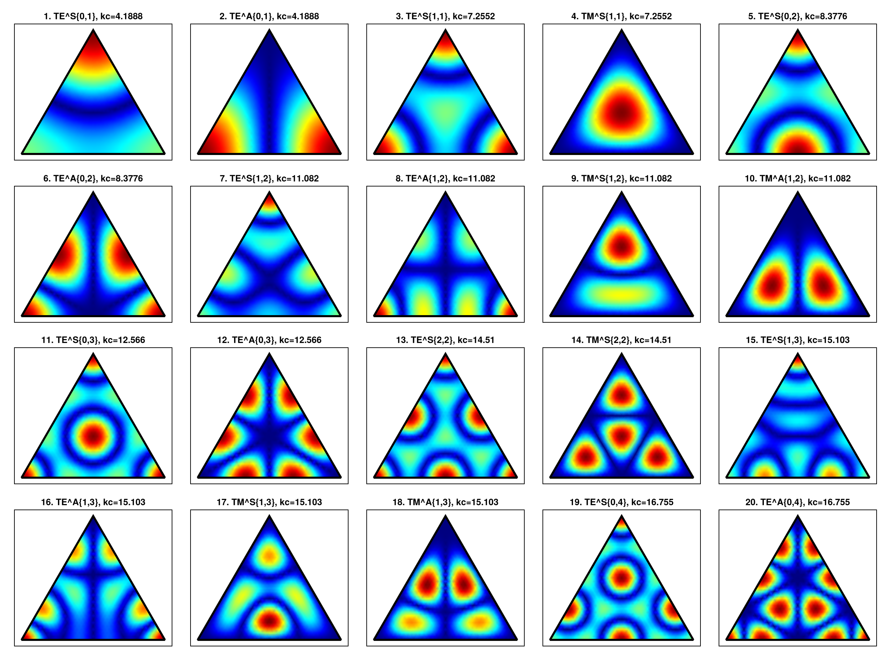
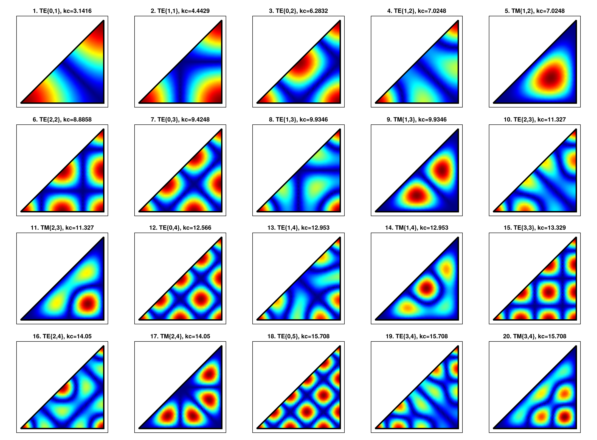
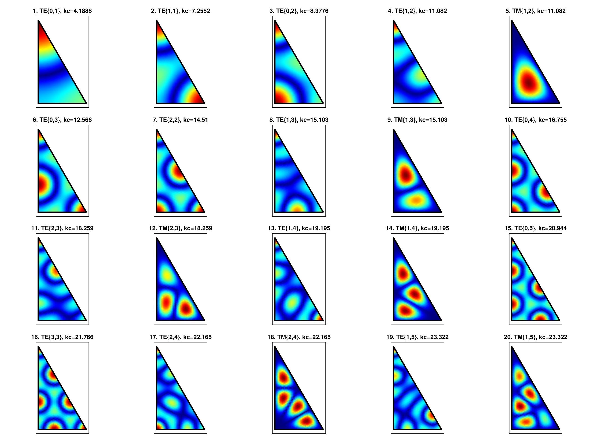

```@meta
    ShareDefaultModule = true
```

# Triangular Waveguides

Triangular waveguides are less common than rectangular or circular guides because
a general triangle does not lead to a separable Helmholtz problem. Analytic
solutions are only available for a small set of highly symmetric triangles:

- equilateral triangles,
- right isosceles triangles,
- half-equilateral triangles, also known as 30-60-90 triangles.

These domains are implemented as reflection modes. The field API follows the
same convention used by the rectangular and circular waveguides: each geometry
provides cutoff functions and TE/TM field functions evaluated at points of the
reference cross-section.

## Reference Geometries

The triangular modes are defined on fixed reference domains. The side length is
the only geometric parameter.

```julia
EquilateralTriangle(side)
RightIsoscelesTriangle(side)
HalfEquilateralTriangle(side)
```

The equilateral triangle has vertices `(0, 0)`, `(side, 0)`, and
`(side / 2, sqrt(3) * side / 2)`. The right isosceles triangle has vertices
`(0, 0)`, `(side, 0)`, and `(side, side)`, i.e. the half of the square
`0 <= y <= x <= side`. The half-equilateral triangle has vertices `(0, 0)`,
`(side / 2, 0)`, and `(0, sqrt(3) * side / 2)`, i.e. the domain
`0 <= x <= side / 2` and `0 <= y <= sqrt(3) * (side / 2 - x)`.

!!! note
    Some index pairs produce zero or duplicate modes. In particular,
    right-isosceles TM modes with `m == n` vanish identically.

    For the equilateral triangle, the generic orientation subspace is already
    represented by the `:S` and `:A` families. The permuted pair `(n, m)` is not
    listed separately because it gives the same scalar mode up to sign.

## Cutoff Wavenumbers

For the equilateral and half-equilateral cases, the cutoff wavenumber is

```math
k_c = \frac{4\pi}{3a}\sqrt{m^2 + mn + n^2}.
```

For the right isosceles triangle, the modes are inherited from a square and

```math
k_c = \frac{\pi}{a}\sqrt{m^2 + n^2}.
```

The cutoff functions follow the naming convention used by the other waveguide
families:

```julia
kc_equilateral(side, m, n)
kc_right_isosceles(side, m, n)
kc_half_equilateral(side, m, n)
```

The first modes ordered by cutoff wavenumber can be obtained with:

```julia
first_n_modes_equilateral(N, side)
first_n_modes_right_isosceles(N, side)
first_n_modes_half_equilateral(N, side)
```

The equilateral function returns tuples `(kind, m, n, symmetry, kc)`. The right
isosceles and half-equilateral functions return `(kind, m, n, kc)`.

## Field Evaluation

The TE and TM fields are evaluated with the same argument order used elsewhere
in the package: coordinates, geometry parameters, mode indices, frequency, and
material parameters.

```julia
freq = 10.0e9
side = 1.0

fields_te = te_equilateral_fields(x, y, side, m, n, freq, 1.0, 1.0)
fields_tm = tm_equilateral_fields(x, y, side, m, n, freq, 1.0, 1.0)

fields_te = te_right_isosceles_fields(x, y, side, m, n, freq, 1.0, 1.0)
fields_tm = tm_right_isosceles_fields(x, y, side, m, n, freq, 1.0, 1.0)

fields_te = te_half_equilateral_fields(x, y, side, m, n, freq, 1.0, 1.0)
fields_tm = tm_half_equilateral_fields(x, y, side, m, n, freq, 1.0, 1.0)
```

Each call returns `(Ex, Ey, Ez, Hx, Hy, Hz)`. For TE modes the longitudinal
scalar is `Hz`; for TM modes it is `Ez`, as in the rectangular waveguide API.

## Power Normalization

Triangular modes provide the same unit-power normalization convention used by
the other waveguide families. The normalization functions return the amplitude
factor that scales the unnormalized fields to one watt of transmitted power.

```julia
kc = kc_equilateral(side, m, n)
β = phase_constant(kc, freq, 1.0, 1.0)

Nte = te_normalization_equilateral(side, m, n, :S, kc, β, freq, 1.0, 1.0)
Ntm = tm_normalization_equilateral(side, m, n, :S, kc, β, freq, 1.0, 1.0)

Nte = te_normalization_right_isosceles(side, m, n, kc, β, freq, 1.0, 1.0)
Ntm = tm_normalization_right_isosceles(side, m, n, kc, β, freq, 1.0, 1.0)

Nte = te_normalization_half_equilateral(side, m, n, kc, β, freq, 1.0, 1.0)
Ntm = tm_normalization_half_equilateral(side, m, n, kc, β, freq, 1.0, 1.0)
```

Internally, the power is computed from the transverse Poynting flux using the
closed-form scalar norms of the reflected triangular modes.

The lower-level mode API can also be used when the scalar Helmholtz function is
needed directly:

```julia
triangle = EquilateralTriangle(side)
mode = TE(triangle, m, n; symmetry = :S)

kc(mode)
ψ(mode, x, y)
∇ψ(mode, x, y)
```

For equilateral triangles, `symmetry = :S` and `symmetry = :A` select the
symmetric and antisymmetric families with respect to the reference median. The
right isosceles and half-equilateral wrappers select the appropriate symmetry
internally.

## Analytical Results

The following galleries show the magnitude of the longitudinal scalar component
for the first distinct modes ordered by cutoff wavenumber. Repeated scalar
patterns are omitted. For TE modes this is `Hz`; for TM modes this is `Ez`.

### Equilateral Triangle



### Right Isosceles Triangle



### Half-Equilateral Triangle



## Reflection Construction

The triangular solutions are not a new separable coordinate system. They are
obtained by reflecting the triangle across its sides. For the three supported
geometries, repeated reflections tile the plane periodically, so the scalar
Helmholtz solution can be written as a finite combination of plane waves.

The equilateral triangle is the fundamental case: its modes live on a triangular
lattice and lead to the cutoff expression involving `m^2 + mn + n^2`. The right
isosceles triangle is obtained from a square by taking symmetric or
antisymmetric combinations across the diagonal. The half-equilateral triangle is
obtained by restricting equilateral modes to one half of the domain. For the
current API, TE half-equilateral modes are obtained from symmetric equilateral
modes, while TM half-equilateral modes are obtained from antisymmetric
equilateral modes.

This reflection construction is also the reason why a generic triangular
waveguide is not included: an arbitrary triangle does not generate a periodic
tessellation with a finite analytic mode basis.
